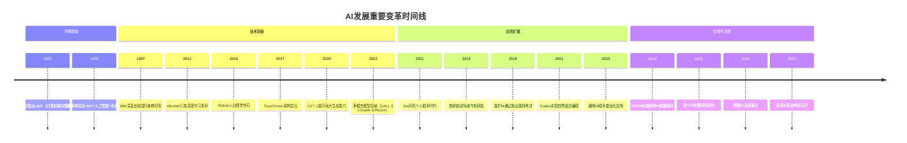

- 👋 Hi, I’m @TaylorPzreal
- 👀 I’m interested in coding.
- 🌱 I’m currently learning AI.

<!---
TaylorPzreal/TaylorPzreal is a ✨ special ✨ repository because its `README.md` (this file) appears on your GitHub profile.
You can click the Preview link to take a look at your changes.
--->

